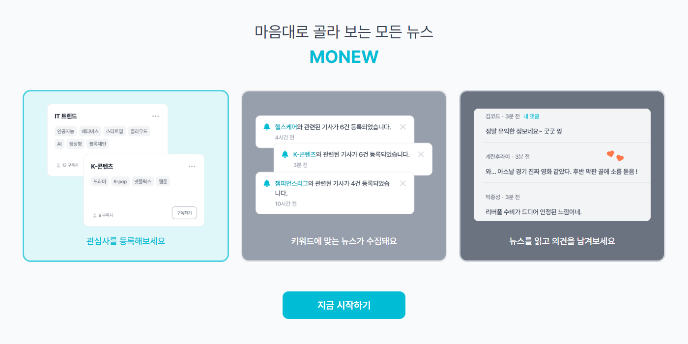
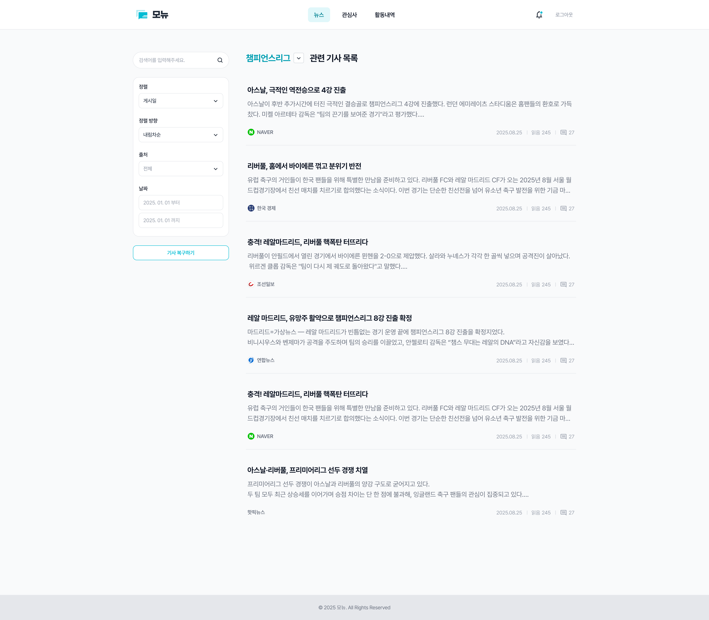
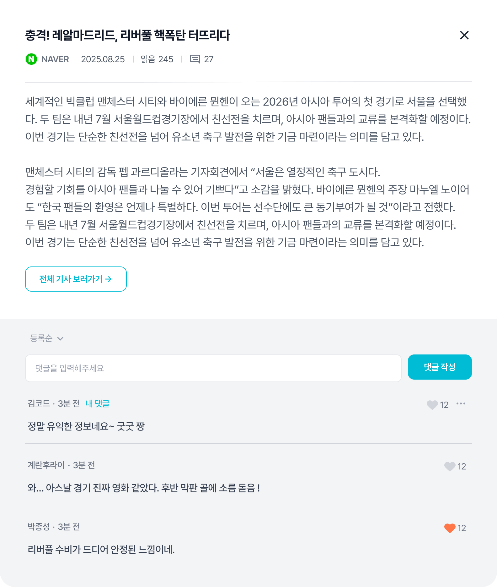

<div align="center">
  
</div>

### 🖐️ 프로젝트 소개

<div align="center">
  
  </br>
  </br>
  <blockquote>여러 뉴스 API를 통합하여 사용자에게 맞춤형 뉴스를 제공하고, 의견을 나눌 수 있는 소셜 기능을 갖춘 서비스
  </blockquote>
  </br>
  </br>
  </br>
</div>
<div align="center">
  <p>
    <strong>Monew</strong>는 사용자가 등록한 관심사를 기반으로 개인화된 뉴스를 제공하고, 댓글과 좋아요를 통해 다른 사용자들과 의견을 나눌 수 있는 소셜 뉴스 플랫폼입니다.
  </p>
  <nav>
    <a href="#서비스소개">📅 서비스 소개</a></br>
    <a href="#시작하기">🚀 시작하기</a></br>
    <a href="#주요기술스택">💎 주요 기술 스택</a></br>
    <a href="#폴더 구조">🗂️ 폴더 구조</a></br>
    <a href="#팀원소개">🧑 팀원 소개</a></br>
  </nav>

<br/>

</div>
<h2 id="서비스소개">📅 서비스 소개</h2>
<div align="center">
  <section>
    <h3>📰 맞춤형 뉴스 큐레이션</h3>
    <p>
    📢 관심사를 등록하면 관련된 뉴스 기사를 자동으로 추천받을 수 있습니다.</br>
    📢 여러 뉴스 API를 통합하여 다양한 출처의 뉴스를 한 곳에서 확인할 수 있습니다.
    </p>
    
  </section>
  </br>
  <section>
    <h3>💬 소셜 기능으로 의견 공유</h3>
    <p>📢 뉴스 기사에 댓글을 달아 다른 사용자들과 의견을 나눌 수 있습니다.</br>
    📢 수정 및 삭제 기능을 통해 자유롭게 소통할 수 있습니다.</br>
    📢 좋아요 기능으로 관심 있는 뉴스와 댓글에 공감을 표현할 수 있습니다.
    </p>
    
  </section>
  </br>
  </br>
  <section>
    <h3>⏬아래 링크를 클릭하시면 더 다양한 기능들을 만날 수 있습니다!⏬</h3>
    <a href="https://monew.vercel.app">⏩지금 Monew 사용하러 가보기!⏪</a>
  </section>
</div>

<br />

<h2 id="시작하기">🚀 시작하기</h2>

### 사전 요구사항

- Node.js 20.19+ 또는 22.12+ 이상 (Vite 요구사항)
- npm 또는 yarn

> ⚠️ Node.js 버전 확인
>
> ```bash
> node -v
> ```
>
> 버전이 낮다면 [Node.js 공식 사이트](https://nodejs.org/)에서 최신 LTS 버전을 설치하세요.

### 설치방법

1. **저장소 클론**

```bash
git clone https://github.com/team-monew/Monew.git .
```

2. **의존성 설치**

```bash
npm install
# 또는
yarn install
```

### 실행방법

#### **개발 서버 실행**

```bash
npm run dev
# 또는
yarn dev
```

브라우저에서 `http://localhost:5173` 접속

#### **프로덕션 빌드**

```bash
npm run build
```

<br />

<h2 id="주요기술스택">💎 주요 기술 스택</h2>

| 기술 이름                                                                                                               | 선정 이유                                                                                                               |
| ----------------------------------------------------------------------------------------------------------------------- | ----------------------------------------------------------------------------------------------------------------------- |
|                | 컴포넌트 기반 설계 방식으로 재사용 가능한 UI를 구축하고, Virtual DOM을 통한 효율적인 렌더링을 위해 선정했습니다.        |
|      | Props 타입 지정으로 인한 런타임 오류 감소, IDE 자동 완성 기능 등 타입 안정성을 통한 코드 품질 개선을 위해 선정했습니다. |
|                  | 빠른 개발 서버 시작 속도와 HMR(Hot Module Replacement)을 통한 개발 생산성 향상을 위해 선정했습니다.                     |
|  | SPA에서 클라이언트 사이드 라우팅을 구현하고, 페이지 전환 시 부드러운 사용자 경험을 제공하기 위해 선정했습니다.          |
|                | axios instance의 interceptor 기능을 통한 중복 코드 최소화 및 여러 뉴스 API 통합 관리를 위해 선정했습니다.               |
|  | 유틸리티 클래스 사용으로 클래스 네이밍 고민 감소, 디자인 시스템이 미흡할 시 유연한 대응이 가능하기에 선정했습니다.      |
|         | 경량화된 날짜 처리 라이브러리로 뉴스 게시 시간, 댓글 작성 시간 등을 직관적으로 포맷팅하기 위해 선정했습니다.            |
|       | 사용자 액션(좋아요, 댓글 작성, 관심사 등록 등)에 대한 즉각적인 피드백을 제공하여 UX를 향상시키기 위해 선정했습니다.     |
|              | 코드 품질 향상과 일관된 코딩 스타일 유지, 잠재적 버그를 사전에 방지하기 위해 선정했습니다.                              |
|          | 자동 코드 포맷팅을 통한 일관된 코드 스타일 유지 및 팀원 간 코드 리뷰 시 스타일 논쟁을 줄이기 위해 선정했습니다.         |
|                  | Git hooks를 통한 커밋 전 자동 린트 및 포맷팅 검사로 코드 품질을 보장하고, 불필요한 커밋을 방지하기 위해 선정했습니다.   |

<br />

<h2 id="폴더 구조">🗂️ 폴더 구조</h2>

```text
MONEW/
├─ public/
│  ├─ fonts/
│  └─ favicon.ico
├─ src/
│  ├─ api/                       # 리소스별 API 래퍼 : index.ts + types.ts 페어
│  │  ├─ articles/
│  │  ├─ comments/
│  │  ├─ interests/
│  │  ├─ notifications/
│  │  ├─ user-activities/
│  │  └─ users/
│  ├─ app/                       # 레이아웃/라우트 프레임
│  │  ├─ layouts/
│  │  └─ routes/
│  │     ├─ public/
│  │     └─ private/
│  ├─ assets/                    # 앱에서 쓰는 정적 에셋
│  │  ├─ icons/
│  │  ├─ images/
│  │  └─ logos/
│  ├─ features/                  # 도메인 단위 UI/로직
│  │  ├─ activities/
│  │  │  ├─ components/
│  │  │  └─ hooks/
│  │  ├─ articles/
│  │  │  └─ components/
│  │  ├─ auth/
│  │  │  ├─ components/
│  │  │  ├─ guards/
│  │  │  └─ hooks/
│  │  ├─ comments/
│  │  │  ├─ components/
│  │  │  └─ hooks/
│  │  ├─ interests/
│  │  │  ├─ components/
│  │  │  └─ hooks/
│  │  ├─ notifications/
│  │  │  └─ components/
│  │  └─ user/
│  │     └─ components/
│  ├─ shared/                    # 전역 공용 레이어
│  │  ├─ components/
│  │  │  ├─ button/
│  │  │  ├─ dropdown/
│  │  │  ├─ gnb/
│  │  │  ├─ modal/
│  │  │  ├─ EmptyState.tsx
│  │  │  ├─ Footer.tsx
│  │  │  ├─ SearchBar.tsx
│  │  │  ├─ SelectBox.tsx
│  │  │  ├─ Skeleton.tsx
│  │  │  ├─ Tag.tsx
│  │  │  └─ Toast.tsx
│  │  ├─ constants/
│  │  ├─ hooks/
│  │  ├─ lib/
│  │  ├─ utils/
│  │  ├─ styles/
│  │  └─ types/
│  └─ main.tsx
├─ index.html
├─ vite.config.ts
├─ vite-env.d.ts
├─ eslint.config.js
└─ .gitignore
```

<br/>

<h2 id="팀원소개">🧑 팀원 소개</h2>

<a href="https://www.notion.so/26f2c744f86a8000bdb0d71497422216?source=copy_link">📑 프로젝트 협업 문서(노션) 바로가기</a>

<div align="center">
  <table>
    <tr>
      <td align="center" width="150px">
        <a href="https://github.com/member1">
          
        </a>
        <br />
        <a href="https://github.com/member1"><b>조민지</b></a>
      </td>
      <td align="center" width="150px">
        <a href="https://github.com/sori4606">
          
        </a>
        <br />
        <a href="https://github.com/sori4606"><b>송형진</b></a>
      </td>
    </tr>
  </table>
</div>
<div align="center">
  
</div>
